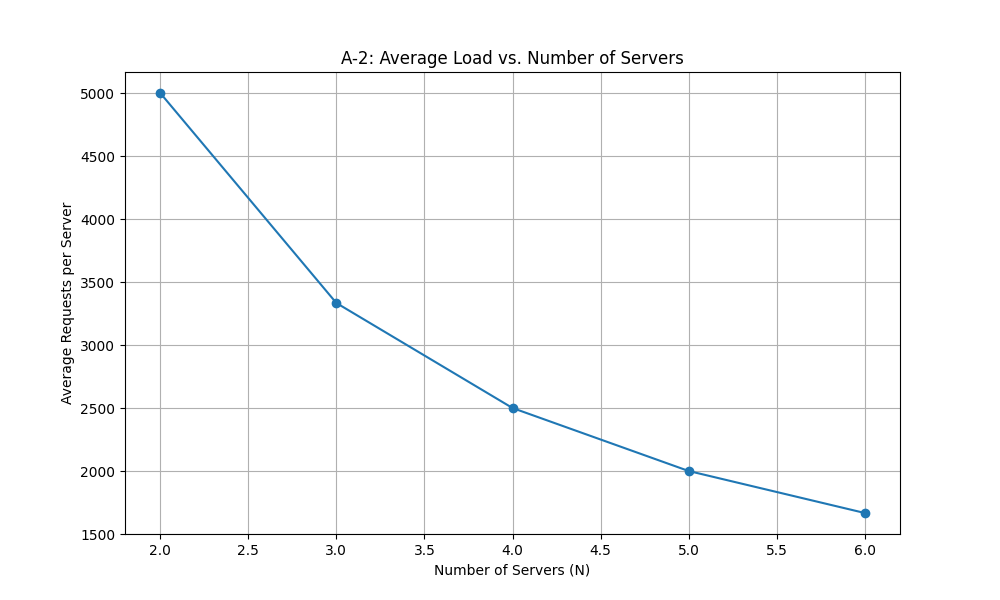

# ds-final-project

## Customizable Load Balancer

A Dockerized load balancer using consistent hashing to distribute requests among server replicas. Supports dynamic scaling and fault tolerance.

---

## Project Structure

```
ds-final-project/
├── analysis/
│   ├── client.py
│   ├── A-1:_Request_Distribution_(N=3).png
│   └── A-2:_Average_Load_vs._Number_of_Servers.png
├── balancer/
│   ├── balancer.py
│   ├── hashing.py
│   ├── Dockerfile
│   └── requirements.txt
├── server/
│   ├── server.py
│   ├── Dockerfile
│   └── requirements.txt
├── docker-compose.yml
├── Makefile
└── README.md
```

---

## Setup Instructions

1. **Clone the Repository:**
    ```bash
    git clone https://github.com/254Nicole-Nase/ds-final-project.git
    cd ds-final-project
    ```

2. **(Optional) Create and activate a Python virtual environment for analysis:**
    ```bash
    python3 -m venv my_env
    source my_env/bin/activate
    pip install aiohttp matplotlib
    ```

3. **Build and Launch the System:**
    ```bash
    make up
    ```

4. **Run the Analysis Client:**
    ```bash
    cd analysis
    python client.py
    ```

---


# Task 1 - Server - Steps
1. Make a python virtual environment
2. Install Flask and other requirements - requirements.txt
3. Build and run docker image
4. Test endpoints

## Task 3 - Load Balancer Functionality & Fault Tolerance

Goal

Deploy a consistent-hashing-based load balancer that:
1. Dynamically spins up and tracks server replicas
2. Routes traffic based on consistent hashing
3. Detects and removes failed replicas
### Steps

#### Start the system:
```bash
make up
```
Add replicas:
```bash
curl -X POST http://localhost:5000/add -H "Content-Type: application/json" -d '{"n": 3}'
```
Expected response:
```bash
{"message":{"N":3,"replicas":["S1","S2","S3"]},"status":"successful"}
```
Send requests to /home:
```bash
curl http://localhost:5000/home
```
Expected output rotates between:
```bash
{"message":"Hello from Server: 1","status":"successful"}
```
Simulate a server failure:
```bash
docker stop S2
```
Then:
```bash
curl http://localhost:5000/home
```
Expected failure handling:
```bash
[{"message":"Server S2 was down and removed","status":"failure"},500]
```
Add or remove servers dynamically:
```bash
curl -X POST http://localhost:5000/add -H "Content-Type: application/json" -d '{"n": 1}'
curl -X DELETE http://localhost:5000/rm -H "Content-Type: application/json" -d '{"n": 1, "hostnames":["S3"]}'
```
Verify system state:
```bash
curl http://localhost:5000/rep
docker ps
docker logs balancer
```

## Task 4: Analysis and Observations
### System Architecture
- **Clients** send requests to the load balancer.
- **Load Balancer** (Flask app in `balancer/`) uses consistent hashing to distribute requests to server replicas.
- **Servers** (Flask app in `server/`) respond to `/home` and `/heartbeat`.
- All components run in Docker containers on a shared Docker network.

### Design Choices & Assumptions
- **Consistent Hashing:**  
  - `num_slots = 512`, `K = log2(num_slots)`.
  - Hash functions:
    - `hash_request(i) = i^2 + 2i + 17`
    - `hash_virtual(i, j) = i^2 + j^2 + 2j + 25`
  - **Collision Handling:** Linear probing is used when adding virtual nodes to the hash ring.
- **Server Management & Fault Tolerance:**  
  - The balancer adds/removes servers via Docker.
  - Fault tolerance is **reactive**: a server is removed and replaced when a request to it fails.
- **Deployment:** Docker Compose and Makefile are used for orchestration.
### Setup and Deployment
- Prerequisites: Docker, Docker Compose, Python 3 (for analysis client).
- Directory structure: see above.
- Build and run: `make up`
- Analysis: `cd analysis && python client.py`
### Methodology
- Used `analysis/client.py` (Python, aiohttp) to send 10,000 asynchronous requests for each experiment.
- Collected request counts per server from responses.
- Generated charts using matplotlib, saved in `analysis/`.
---

### **A-1: Load Distribution (N=3)**
**Procedure:**  
- Ensured 3 servers running.
- Sent 10,000 requests to `/home`.
**Results:**  
.png)
- **Terminal output:**  
  
- **Observation:**  
  Requests were unnevenly distributed. 
- Consistent hashing achieved its goal of balanced load.
---

### **A-2: Scalability (N=2 to N=6)**
**Procedure:**  
- Varied N from 2 to 6.
- Sent 10,000 requests for each N.
- Calculated average load per server.

**Results:**  
- **Line chart:**                                                                  |    - **Terminal output:**  
                 |      
- **Observation:**  
  As N increased, average load per server decreased. 
---

### **A-3: Server Failure and Recovery**
**Procedure:**  
- Stopped a server manually (`docker stop S1`).
- Sent requests to `/home` and observed balancer logs and server list.
- **Terminal output:**                                                                 - **docker ps after recovery:**  
                                     
- **Observation:**  
  Balancer detected failure and replaced the server. Load was re-distributed.

---

### A-4: Impact of Modified Hash Functions
- **Observation:**  
  With poor hash functions, distribution was worse. Good hash functions minimize collisions and balance load.

---

## Conclusion

- The system partly met the goals for balanced load, scalability, and fault tolerance.


